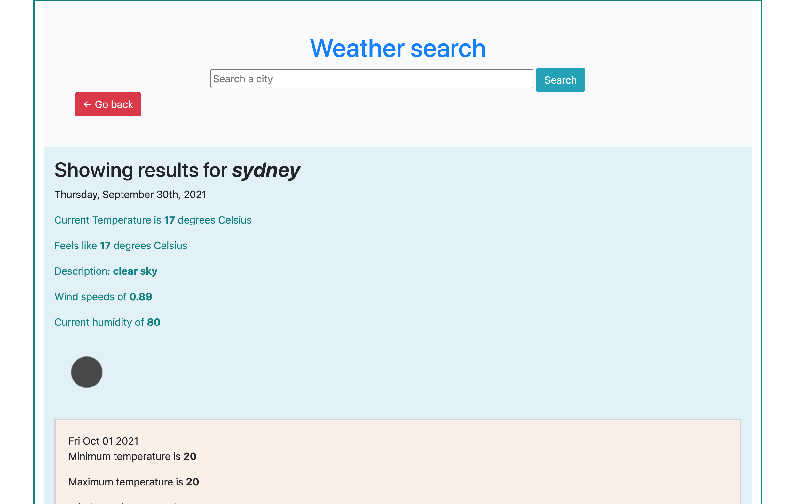
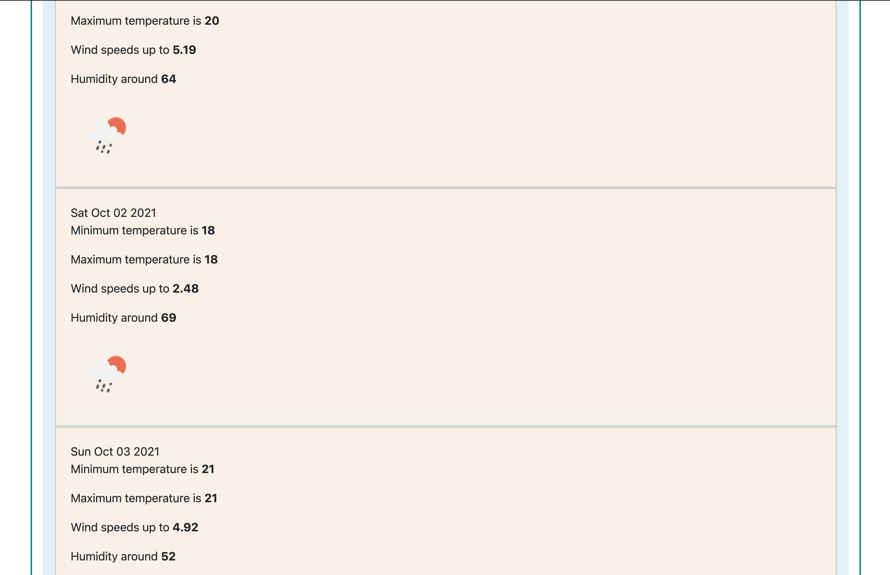
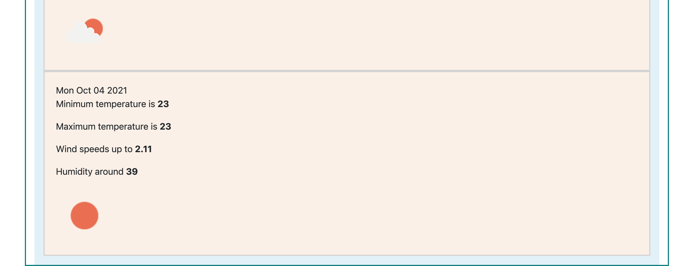

This homework task required a weather app to be created.
Open weather API has been used to fetch the required weather information.
This app has an input field to which you can type in a city.
When you search for a city, the current date and weather comes up with the current temp, what it feels like,
weather description, wind speeds and current humidity.
An icon is also displayed that shows the current temperature.
The forecast for the next 4 days is also presented upon searching a city.
The forecare presents the date, temperature, wind speeds, humidity, and icon.
When another city is searched, the previous weather information is overridden and the current city weather information is displayed.
I was not able to create storage that saves previous searches in history that is displayed on the page.
I was also unable to find the UV index on this API, and so that information is also missing. 
A "go back" button brings the user to the beginning search page.

Link to deployed application: https://ahooper00.github.io/homework-06/